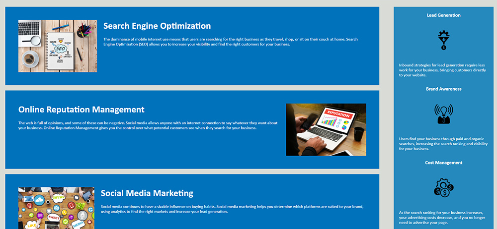

# Refactor 

## overview
As a developer, it's very important to keep your code in an easy to read format for future developers or for the browsers to distinguish between different types of data.
This page has been optimized on both the HTML and CSS . 
1. replaced elements with semantic
2. consolidated CSS
3. added alt text to images
4. added commenting 

link for live page:
<https://nickverneck.github.io/Refactor/>

